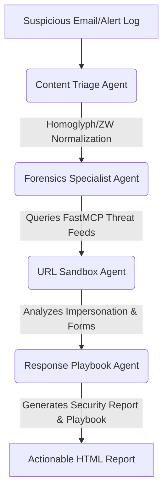

# 🛡️ AI Email Security Assistant
### Multi-Agent Security Orchestration & Incident Response System

[](https://www.python.org/)
[](https://fastapi.tiangolo.com/)
[](https://ai.google.dev/)
[](LICENSE)

**AI Email Security Assistant** is a modern, enterprise-ready multi-agent security incident response platform. It automates the investigation and containment of suspicious emails and alert logs using a pipeline of **five specialized Gemini AI agents** running via Google's `google.adk` framework. 

When a security threat is detected, it guides the user through interactive containment steps to block malicious IPs and domains in real time.

---

## 🛠️ Built With

*   **[Google ADK](https://github.com/google/adk)**: Google's multi-agent orchestrator framework.
*   **[Gemini 2.5 Flash API](https://ai.google.dev/)**: Powering core reasoning, classifications, and playbook drafting.
*   **[Model Context Protocol (MCP)](https://modelcontextprotocol.io/)**: Gateway bridging AI agents with local lookup tools.
*   **[FastAPI](https://fastapi.tiangolo.com/)**: Exposing real-time streaming endpoints.
*   **[Starlette SSE](https://github.com/sysid/sse-starlette)**: Server-Sent Events (SSE) streaming logs dynamically to the browser.
*   **[BeautifulSoup4](https://www.crummy.com/software/BeautifulSoup/)**: Driving URL text parsing inside the sandbox agent.

---

## 🎯 Key Challenges Solved

1. **Obfuscation Detection:** Programmatically identifies bypass attempts like **zero-width space characters** and **Cyrillic homoglyph characters** (identical-looking letters from different alphabets used to evade standard filters).
2. **Context Aggregation:** Extracts IP addresses, domains, and URLs, and automatically researches them via a Model Context Protocol (MCP) server.
3. **API Resilience:** Automatically switches the remaining stages to local fallback engines (regex, keyword heuristics, direct MCP hooks) if the Gemini API runs out of quota or encounters 5xx network errors.
4. **No-Code Interactive Console:** Provides a clean multi-step wizard interface designed for IT analysts and non-technical staff to safely review alerts, block threats, and consult an AI assistant.

---

## 📐 Agent Collaboration Workflow
Instead of a single large prompt, the workflow delegates specialized operations to distinct agent personas:



*   **Content Triage Agent**: Checks the email structure for text obfuscation and classifies initial fraud risk.
*   **Forensics Specialist Agent**: Extracts Indicators of Compromise (IOCs) like IPs, domains, and URLs.
*   **Threat Intel Server**: Queries WHOIS records and Geolocation data using an MCP bridge.
*   **URL Sandbox Agent**: Performs simulated virtual scans on urls for phishing forms or brand impersonations.
*   **Response Playbook Agent**: Computes threat levels and generates actionable playbooks containing suggested firewall rules and DNS blocks.

---

## 🚀 Quick Start Guide

### 1. Prerequisites
Ensure you have Python 3.10+ and Node.js (optional, for shortcuts) installed.

### 2. Installation
Clone the repository and install the dependencies:
```bash
# Create and activate virtual environment
python -m venv venv
source venv/bin/activate  # On Windows use: venv\Scripts\activate

# Install requirements
pip install -r requirements.txt
```

### 3. Environment Configuration
Copy the template environment file:
```bash
copy .env.example .env
```
Open `.env` and set your Gemini API key:
```env
GEMINI_API_KEY=your_actual_api_key_here
```
> [!NOTE]  
> If no API key is provided, the application will launch in **Local Offline Mode**, using rule-based parsing and mock databases.

### 4. Running the Dashboard
You can run the web server using standard shortcuts:
```bash
npm run dev
# or manually
python src/web_server.py
```
Open [http://localhost:8000](http://localhost:8000) in your browser to access the console.

---

## 🛠️ Usage Walks

### Step 1: Input Ingestion
* Paste any suspicious email text (or click one of the quick presets like **Job Offer Scam** or **Safe PayPal Email**).
* Click **Scan for Threats**. The interface will automatically transition to the progress logger.

### Step 2: Live Scanning Progress
* Watch the agent nodes light up in the wizard bar as they execute.
* The console log streams events dynamically, updating the risk severity, estimated session cost, and pipeline duration metrics.

### Step 3: Security Report & Containment Controls
* Review the formatted report generated by the playbook agent.
* **Stop the Threat**: Click **Deploy Block** or **Block Domain** to trigger mitigation policies.
* **Security Chat Assistant**: Ask follow-up questions directly to the AI helper in the chat bubble (e.g., *"Why did we block this IP address?"*).

---

## 📂 Project Structure

```
myagent/
├── README.md               # Visual project documentation
├── requirements.txt        # Python package dependencies
├── package.json            # Node.js shortcuts (npm run dev, npm test)
├── .env.example            # Environment variables template
├── .gitignore              # Git ignore file (prevents committing secrets)
├── config/
│   └── __init__.py         # Model parameters & whitelist configurations
├── src/
│   ├── __init__.py
│   ├── main.py             # CLI runner & system containment adapters
│   ├── agents.py           # ADK agents definition & streaming pipeline
│   ├── mcp_server.py       # FastMCP threat intelligence tool adapters
│   ├── web_server.py       # FastAPI web server driving the SSE stream
│   ├── static/
│   │   └── index.html      # Glassmorphic multi-step wizard dashboard
│   └── utils/
│       ├── __init__.py
│       └── security.py     # Unicode homoglyphs & zero-width normalization
└── tests/
    ├── __init__.py
    ├── evaluate.py         # Automated Kaggle Capstone benchmark evaluate suite
    ├── test_endpoints.py   # FastAPI endpoints unit tests
    ├── test_offline.py     # Local fallback logic unit tests
    └── smoke_test.py       # Pipeline connection check integration test
```

---

## 🧪 Testing & Validation

To verify the test suite compiles and runs correctly, run:
```bash
npm test
# or
python -m unittest tests/test_endpoints.py
```

To run the full automated accuracy and precision evaluations suite:
```bash
npm run evaluate
# or
python tests/evaluate.py
```

---

## 🛡️ License
Distributed under the MIT License. See `LICENSE` for more information.
